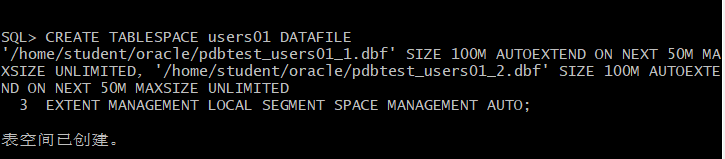
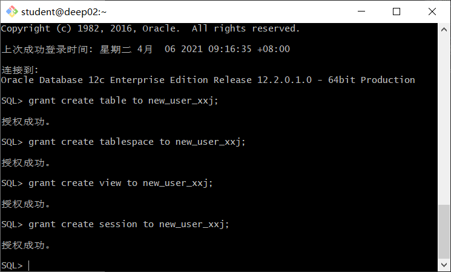
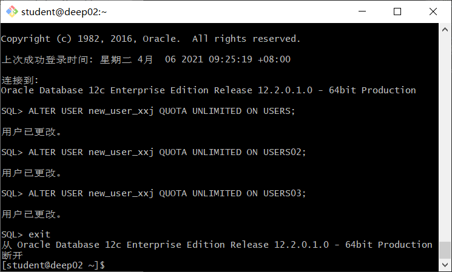
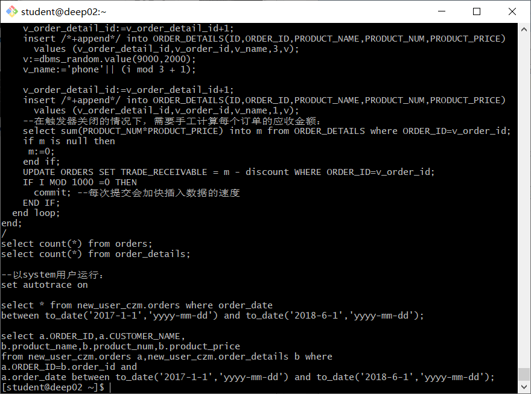
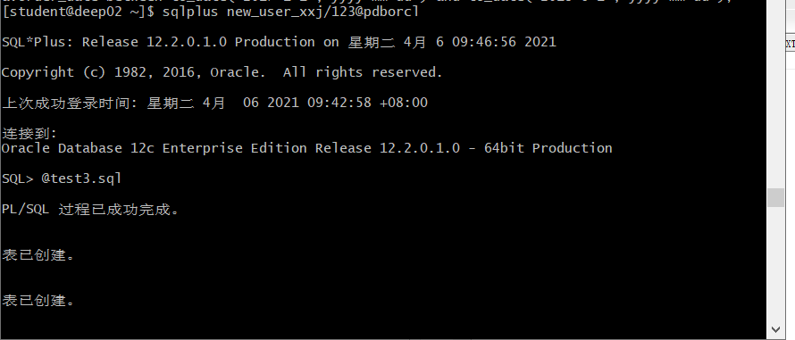
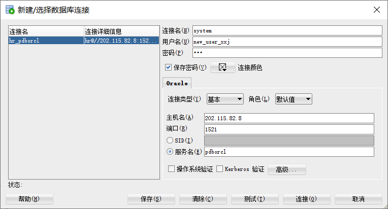
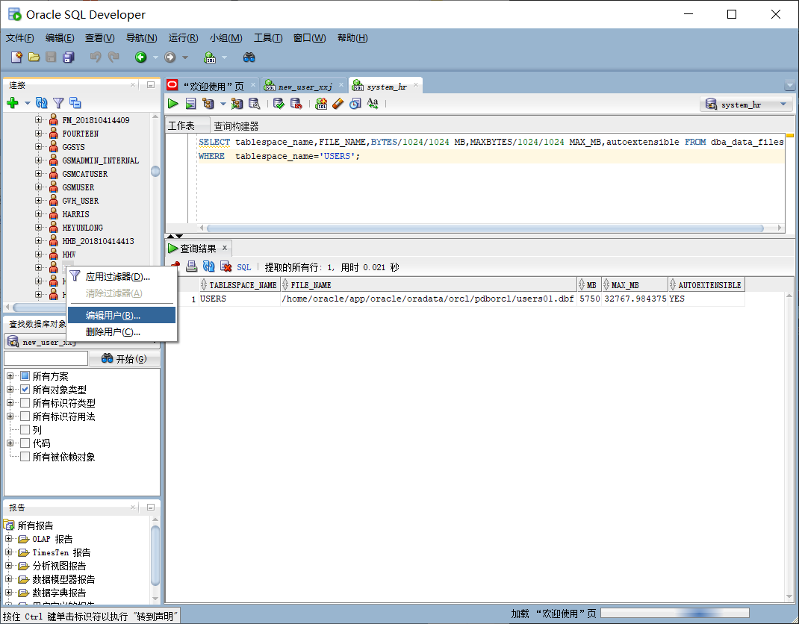
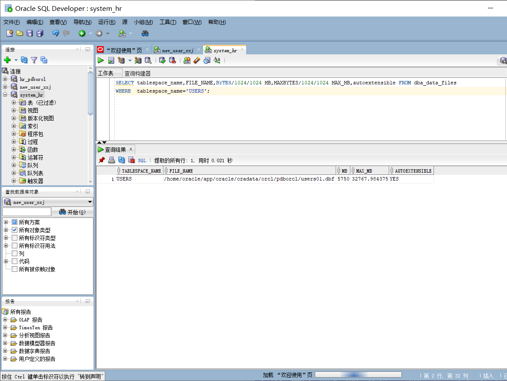

姓名：熊小娇

用户名：new_user_xxj

学号：201810414104

班级：18软工1班


# 实验三

## 实验目的
掌握分区表的创建方法，掌握各种分区方式的使用场景。
## 实验要求
* 本实验使用3个表空间：USERS,USERS02,USERS03。在表空间中创建两张表：订单表(orders)与订单详表(order_details)。
* 使用你自己的账号创建本实验的表，表创建在上述3个分区，自定义分区策略。
* 你需要使用system用户给你自己的账号分配上述分区的使用权限。你需要使用system用户给你的用户分配可以查询执行计划的权限。
* 表创建成功后，插入数据，数据能并平均分布到各个分区。每个表的数据都应该大于1万行，对表进行联合查询。
* 写出插入数据的语句和查询数据的语句，并分析语句的执行计划。
* 进行分区与不分区的对比实验。

## 查询语句


#### 因为目前只有表空间USERS，没有USERS02,USERS03，所以需要创建
### 语句1：
#### 第1步：创建表空间USERS02，USERS03：

#### sql语句
```sql
    --创建USERS02
    CREATE TABLESPACE USERS02 DATAFILE
    '/home/oracle/app/oracle/oradata/orcl/pdborcl/pdbtest_user02_1.dbf'
    SIZE 100M
    AUTOEXTEND ON
    NEXT 50M
    MAXSIZE UNLIMITED,
    '/home/oracle/app/oracle/oradata/orcl/pdborcl/pdbtest_user02_2.dbf'
    SIZE 100M
    AUTOEXTEND ON
    NEXT 50M
    MAXSIZE UNLIMITED
    EXTENT MANAGEMENT LOCAL SEGMENT SPACE MANAGEMENT AUTO;

    --创建USERS03
    CREATE TABLESPACE USERS03 DATAFILE
    '/home/oracle/app/oracle/oradata/orcl/pdborcl/pdbtest_user03_1.dbf'
    SIZE 100M
    AUTOEXTEND ON
    NEXT 50M
    MAXSIZE UNLIMITED,
    '/home/oracle/app/oracle/oradata/orcl/pdborcl/pdbtest_user02_2.dbf'
    SIZE 100M
    AUTOEXTEND ON
    NEXT 50M
    MAXSIZE UNLIMITED
    EXTENT MANAGEMENT LOCAL SEGMENT SPACE MANAGEMENT AUTO;
```

### 查询结果：


### 语句2：
#### 第2步：首先创建自己的账号your_user，然后以system身份登录:：
```sql
    [student@deep02 ~]$sqlplus system/123@localhost/pdborcl
    SQL>ALTER USER new_user_xxj QUOTA UNLIMITED ON USERS;
    SQL>ALTER USER new_user_xxj QUOTA UNLIMITED ON USERS02;
    SQL>ALTER USER new_user_xxj QUOTA UNLIMITED ON USERS03;
    SQL>exit
```


### 查询结果：




### 语句3：
#### 第3步：然后以自己的账号new_user_xxj身份登录,并运行脚本文件test3.sql:。

```sql
    [student@deep02 ~]$cat test3.sql
    [student@deep02 ~]$sqlplus new_user_xxj/123@localhost/pdborcl
    SQL>@test3.sql
    SQL>exit
```


### 查询结果




### 语句4：
#### 第4步：以下样例查看表空间的数据库文件，以及每个文件的磁盘占用情况：
```sql
    $ sqlplus system/123@202.115.82.8/czm
    SQL> SELECT tablespace_name,FILE_NAME,BYTES/1024/1024 MB,MAXBYTES/1024/1024 MAX_MB,autoextensible FROM dba_data_files  WHERE  tablespace_name='USERS';
    SQL>SELECT a.tablespace_name "表空间名",Total/1024/1024 "大小MB",
    free/1024/1024 "剩余MB",( total - free )/1024/1024 "使用MB",
    Round(( total - free )/ total,4)* 100 "使用率%"
    from (SELECT tablespace_name,Sum(bytes)free
            FROM   dba_free_space group  BY tablespace_name)a,
        (SELECT tablespace_name,Sum(bytes)total FROM dba_data_files
            group  BY tablespace_name)b
    where  a.tablespace_name = b.tablespace_name;
```
### 查询结果

- autoextensible是显示表空间中的数据文件是否自动增加。
- MAX_MB是指数据文件的最大容量


### 语句5：
#### 第5步：可以在SQL-DEVELOPER上面登陆账号查看数据：Oracle地址：202.115.82.8 用户名：system,hr,你的用户名 ， 密码123， 数据库名称：pdborcl/或者你的数据库，端口号：1521

```sql
    SQL> SELECT tablespace_name,FILE_NAME,BYTES/1024/1024 MB,MAXBYTES/1024/1024 MAX_MB,autoextensible FROM dba_data_files  WHERE  tablespace_name='USERS';
```
### 查询结果





### 分析
本次实验主要是进行数据库用户操作，对用户进行权限管理操作，首先连接上老师的数据库然后创建自己的用户进行实验。创建分区表，将权限用grant授予创建的表中，将大量数据存入不同的分区，可以提高查询率，以及防止部分出现崩盘数据全部损失。最后通过查看表空间的数据库文件，以及每个文件的磁盘占用情况，我们可以看到虽然进行了分区，但不是每一个分区都一定会被用到，USERS和USERS2的使用率明显高于USERS3的使用率。
