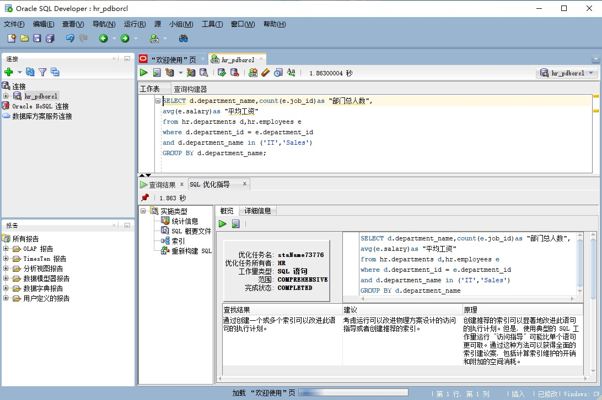

姓名：熊小娇

学号：201810414104

班级：18软工1班

# 实验一

## 实验目的
分析SQL执行计划，执行SQL语句的优化指导。理解分析SQL语句的执行计划的重要作用。
## 实验要求
* 对Oracle12c中的HR人力资源管理系统中的表进行查询与分析。
* 首先运行和分析教材中的样例：本训练任务目的是查询两个部门('IT'和'Sales')的部门总人数和平均工资，以下两个查询的结果是一样的。但效率不相同。
* 设计自己的查询语句，并作相应的分析，查询语句不能太简单。

## 查询语句
### 语句1：
```sql
    set autotrace on
    SELECT d.department_name,count(e.job_id)as "部门总人数",
    avg(e.salary)as "平均工资"
    from hr.departments d,hr.employees e
    where d.department_id = e.department_id
    and d.department_name in ('IT','Sales')
    GROUP BY d.department_name;
```


### 查询结果：

### 执行优化指导：



### 语句2：


```sql
    set autotrace on
    SELECT d.department_name,count(e.job_id)as "部门总人数",
    avg(e.salary)as "平均工资"
    FROM hr.departments d,hr.employees e
    WHERE d.department_id = e.department_id
    GROUP BY d.department_name
    HAVING d.department_name in ('IT','Sales');
```


### 查询结果


### 执行优化指导：

可以看出没有优化建议


### 结论

* 答：查询1用时是62秒左右，而查询二是26秒左右，可以看出查询2比查询1省时，并且查询1有优化建议，而查询2没有优化建议。

## 自己设计的查询语句：

### 语句1：
```sql
    SELECT FIRST_NAME,LAST_NAME,sum(SALARY)
    FROM hr.employees 
    GROUP BY SALARY, FIRST_NAME, LAST_NAME
    HAVING SALARY > 5000
    ORDER BY salary
```


### 查询结果


### 执行优化指导：


### 分析
本次查询实查询员工中工资大于5000的人并且将工资进行升序排序。得到的图二的优化建议。可见接收该概要文件（关于概要文件，是一种类似于统计信息的元数据，直接影响优化器对执行计划的判断）和创建索引，可提升50%以上的性能，注：如到迁移到其他环境，可只创建该索引进行优化，至于概要文件暂无需调整。
### 解决方法
 利用调用oracle自带的sql_tunning包进行调优，发现出该语句较好的概要文件与索引优化思路；直接应用该概要文件于索引创建，从性能数据来看，数据库性能提升了一倍。