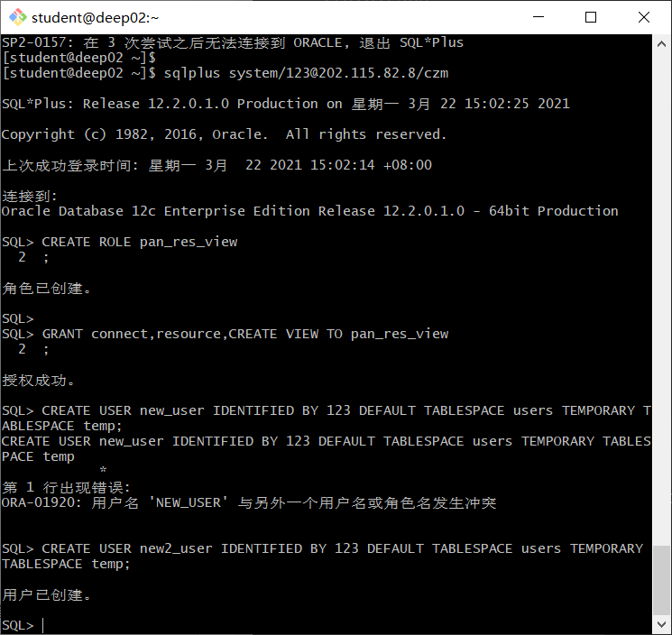
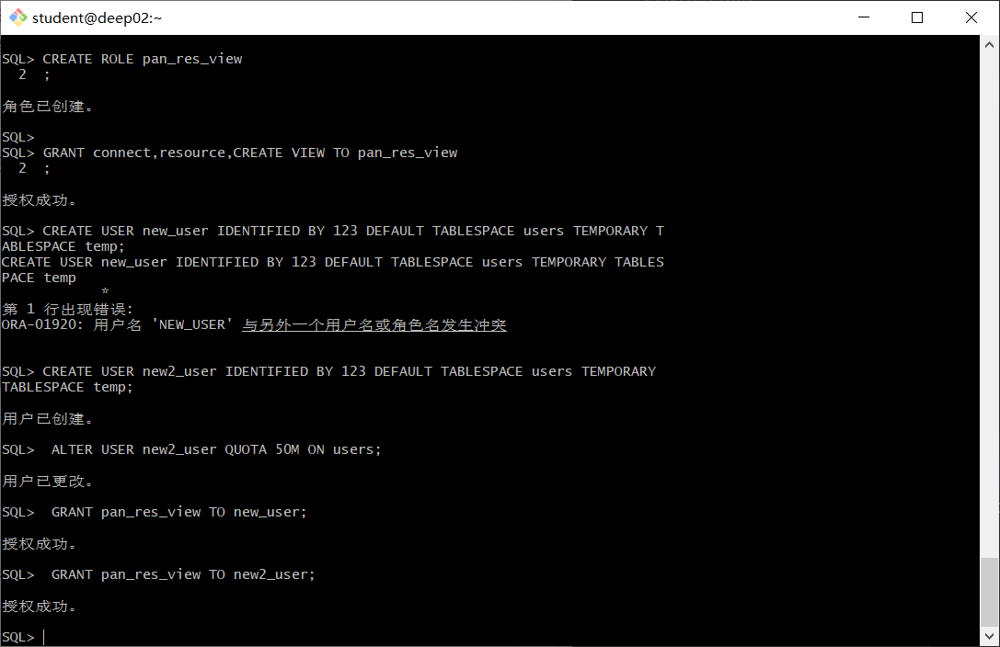
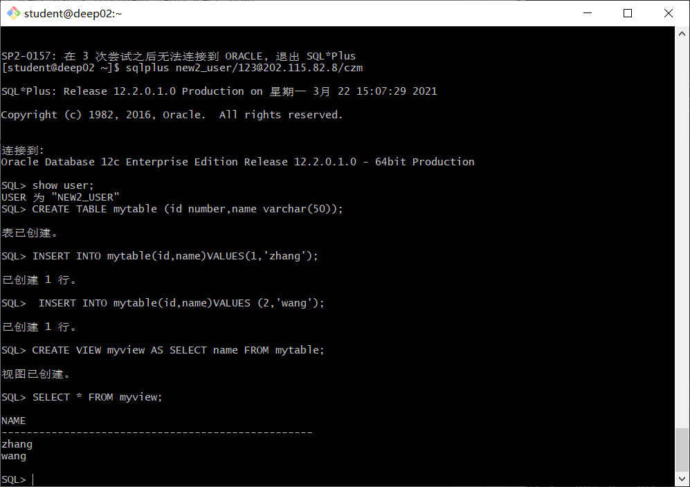
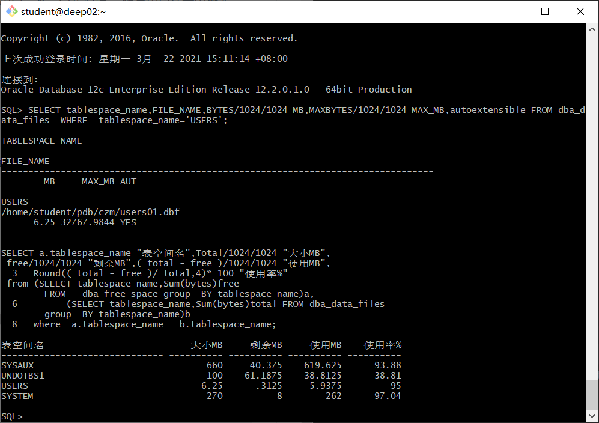
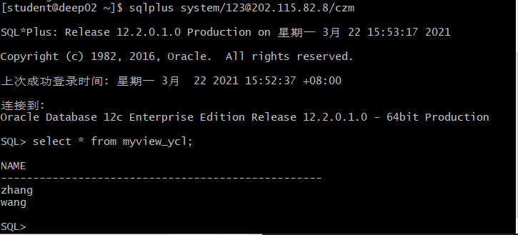

姓名：熊小娇
yb
用户名：new2_users

学号：201810414104

班级：18软工1班

# 实验二

## 实验目的
掌握用户管理、角色管理、权根维护与分配的能力，掌握用户之间共享对象的操作技能。
## 实验要求
* 在pdborcl插接式数据中创建一个新的本地角色con_res_view，该角色包含* connect和resource角色，同时也包含CREATE VIEW权限，这样任何拥有con_res_view的用户就同时拥有这三种权限。
* 创建角色之后，再创建用户new_user，给用户分配表空间，设置限额为50M，授予con_res_view角色。
* 最后测试：用新用户new_user连接数据库、创建表，插入数据，创建视图，查询表和视图的数据。

## 查询语句

### 语句1：
#### 第1步：以system登录到czm，创建角色pan_res_view和用户new_user，并授权和分配空间：
```sql
    $ sqlplus system/123@202.115.82.8/czm
    SQL> CREATE ROLE pan_res_view;
    SQL> GRANT connect,resource,CREATE VIEW TO con_res_view;
    SQL> CREATE USER new_user IDENTIFIED BY 123 DEFAULT TABLESPACE users TEMPORARY TABLESPACE temp;
    SQL> ALTER USER new_user QUOTA 50M ON users;
    SQL> GRANT con_res_view TO new_user;
    SQL> exit
```


### 查询结果：




### 语句2：
#### 第2步：新用户new2_user连接到czm，创建表mytable和视图myview，插入数据，最后将myview的SELECT对象权限授予hr用户。

```sql
    $ sqlplus new2_users/123@202.115.82.8/czm
    SQL> show user;
    SQL> CREATE TABLE mytable (id number,name varchar(50));
    SQL> INSERT INTO mytable(id,name)VALUES(1,'zhang');
    SQL> INSERT INTO mytable(id,name)VALUES (2,'wang');
    SQL> CREATE VIEW myview AS SELECT name FROM mytable;
    SQL> SELECT * FROM myview;
    SQL> GRANT SELECT ON myview TO hr;
    SQL>exit
```


### 查询结果



### 语句3：
#### 第3步：用户hr连接到czm，查询new2_user授予它的视图myview
```sql
    $ sqlplus new2_users/123@202.115.82.8/czm
    SQL> SELECT * FROM new_user.myview;
```
### 查询结果


### 语句4：
#### 第4步：查看表空间的数据库文件，以及每个文件的磁盘占用情况
```sql
    $ sqlplus system/123@202.115.82.8/czm
    SQL>SELECT tablespace_name,FILE_NAME,BYTES/1024/1024 MB,MAXBYTES/1024/1024 MAX_MB,autoextensible FROM dba_data_files  WHERE  tablespace_name='USERS';

    SQL>SELECT a.tablespace_name "表空间名",Total/1024/1024 "大小MB",
    free/1024/1024 "剩余MB",( total - free )/1024/1024 "使用MB",
    Round(( total - free )/ total,4)* 100 "使用率%"
    from (SELECT tablespace_name,Sum(bytes)free
            FROM   dba_free_space group  BY tablespace_name)a,
        (SELECT tablespace_name,Sum(bytes)total FROM dba_data_files
            group  BY tablespace_name)b
    where  a.tablespace_name = b.tablespace_name;
```
### 查询结果



### 查看同学的视图：



### 分析
本次实验主要是进行数据库用户操作，对用户进行权限管理操作，首先连接上老师的数据库然后创建自己的用户进行实验。创建表，将权限用grant授予创建的表中。如果有一组用户，所需权限是一样的，就像本次实验，几十个同学执行一样的权限，会发生冲突，并且会出现很多重复的授权命令，所以在实验开始前，创建角色，将角色赋给用户，就会好操作一些。
