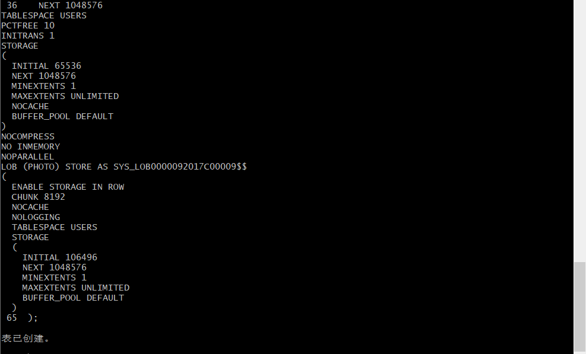

姓名：熊小娇

用户名：new_user_xxj

学号：201810414104

班级：18软工1班


# 实验四

## 实验目的
了解Oracle表和视图的概念，学习使用SQL语句Create Table创建表，学习Select语句插入，修改，删除以及查询数据，学习使用SQL语句创建视图，学习部分存储过程和触发器的使用。
## 实验场景：
假设有一个生产某个产品的单位，单位接受网上订单进行产品的销售。通过实验模拟这个单位的部分信息：员工表，部门表，订单表，订单详单表。
## 实验内容
### 录入数据：
要求至少有1万个订单，每个订单至少有4个详单。至少有两个部门，每个部门至少有1个员工，其中只有一个人没有领导，一个领导至少有一个下属，并且它的下属是另一个人的领导（比如A领导B，B领导C）。

### 序列的应用
插入ORDERS和ORDER_DETAILS 两个表的数据时，主键ORDERS.ORDER_ID, ORDER_DETAILS.ID的值必须通过序列SEQ_ORDER_ID和SEQ_ORDER_ID取得，不能手工输入一个数字。

### 触发器的应用：
维护ORDER_DETAILS的数据时（insert,delete,update）要同步更新ORDERS表订单应收货款ORDERS.Trade_Receivable的值。

### 查询数据：
1.查询某个员工的信息
2.递归查询某个员工及其所有下属，子下属员工。
3.查询订单表，并且包括订单的订单应收货款: Trade_Receivable= sum(订单详单表.ProductNum*订单详单表.ProductPrice)- Discount。
4.查询订单详表，要求显示订单的客户名称和客户电话，产品类型用汉字描述。
5.查询出所有空订单，即没有订单详单的订单。
6.查询部门表，同时显示部门的负责人姓名。
7.查询部门表，统计每个部门的销售总金额。

## 查询语句


#### 因为上一个实验已经在自己的用户中创建了表空间USERS02,USERS03，以及用户study，所以现在不需要创建，直接跳过创建语句；
### 语句1：
#### 第1步：给表空间USERS02，USERS03授权：

#### sql语句
```sql
   -- QUOTAS
    ALTER USER STUDY QUOTA UNLIMITED ON USERS;
    ALTER USER STUDY QUOTA UNLIMITED ON USERS02;
    ALTER USER STUDY ACCOUNT UNLOCK;

    -- ROLES
    GRANT "CONNECT" TO STUDY WITH ADMIN OPTION;
    GRANT "RESOURCE" TO STUDY WITH ADMIN OPTION;
    ALTER USER STUDY DEFAULT ROLE "CONNECT","RESOURCE";

    -- SYSTEM PRIVILEGES
    GRANT CREATE VIEW TO STUDY WITH ADMIN OPTION;
```

#### 查询结果：


### 语句2：
#### 第2步：创建表:

 -- 创建 DEPARTMENTS表
```sql
   CREATE TABLE DEPARTMENTS
    (
    DEPARTMENT_ID NUMBER(6, 0) NOT NULL
    , DEPARTMENT_NAME VARCHAR2(40 BYTE) NOT NULL
    , CONSTRAINT DEPARTMENTS_PK PRIMARY KEY
    (
        DEPARTMENT_ID
    )
    USING INDEX
    (
        CREATE UNIQUE INDEX DEPARTMENTS_PK ON DEPARTMENTS (DEPARTMENT_ID ASC)
        NOLOGGING
        TABLESPACE USERS
        PCTFREE 10
        INITRANS 2
        STORAGE
        (
            INITIAL 65536
            NEXT 1048576
            MINEXTENTS 1
            MAXEXTENTS UNLIMITED
            BUFFER_POOL DEFAULT
        )
        NOPARALLEL
        )
        ENABLE
    )
    NOLOGGING
    TABLESPACE USERS
    PCTFREE 10
    INITRANS 1
    STORAGE
    (
    INITIAL 65536
    NEXT 1048576
    MINEXTENTS 1
    MAXEXTENTS UNLIMITED
    BUFFER_POOL DEFAULT
    )
    NOCOMPRESS NO INMEMORY NOPARALLEL;
```
#### 查询结果：


-- 创建  EMPLOYEES表并创建约束和索引
```sql
     CREATE TABLE EMPLOYEES
  (
    EMPLOYEE_ID NUMBER(6, 0) NOT NULL
  , NAME VARCHAR2(40 BYTE) NOT NULL
  , EMAIL VARCHAR2(40 BYTE)
  , PHONE_NUMBER VARCHAR2(40 BYTE)
  , HIRE_DATE DATE NOT NULL
  , SALARY NUMBER(8, 2)
  , MANAGER_ID NUMBER(6, 0)
  , DEPARTMENT_ID NUMBER(6, 0)
  , PHOTO BLOB
  , CONSTRAINT EMPLOYEES_PK PRIMARY KEY
    (
      EMPLOYEE_ID
    )
    USING INDEX
    (
        CREATE UNIQUE INDEX EMPLOYEES_PK ON EMPLOYEES (EMPLOYEE_ID ASC)
        NOLOGGING
        TABLESPACE USERS
        PCTFREE 10
        INITRANS 2
        STORAGE
        (
          INITIAL 65536
          NEXT 1048576
          MINEXTENTS 1
          MAXEXTENTS UNLIMITED
          BUFFER_POOL DEFAULT
        )
        NOPARALLEL
    )
    ENABLE
  )
  NOLOGGING
  TABLESPACE USERS
  PCTFREE 10
  INITRANS 1
  STORAGE
  (
    INITIAL 65536
    NEXT 1048576
    MINEXTENTS 1
    MAXEXTENTS UNLIMITED
    BUFFER_POOL DEFAULT
  )
  NOCOMPRESS
  NO INMEMORY
  NOPARALLEL
  LOB (PHOTO) STORE AS SYS_LOB0000092017C00009$$
  (
    ENABLE STORAGE IN ROW
    CHUNK 8192
    NOCACHE
    NOLOGGING
    TABLESPACE USERS
    STORAGE
    (
      INITIAL 106496
      NEXT 1048576
      MINEXTENTS 1
      MAXEXTENTS UNLIMITED
      BUFFER_POOL DEFAULT
    )
  );

  CREATE INDEX EMPLOYEES_INDEX1_NAME ON EMPLOYEES (NAME ASC)
  NOLOGGING
  TABLESPACE USERS
  PCTFREE 10
  INITRANS 2
  STORAGE
  (
    INITIAL 65536
    NEXT 1048576
    MINEXTENTS 1
    MAXEXTENTS UNLIMITED
    BUFFER_POOL DEFAULT
  )
  NOPARALLEL;

  ALTER TABLE EMPLOYEES
  ADD CONSTRAINT EMPLOYEES_FK1 FOREIGN KEY
  (
    DEPARTMENT_ID
  )
  REFERENCES DEPARTMENTS
  (
    DEPARTMENT_ID
  )
  ENABLE;

  ALTER TABLE EMPLOYEES
  ADD CONSTRAINT EMPLOYEES_FK2 FOREIGN KEY
  (
    MANAGER_ID
  )
  REFERENCES EMPLOYEES
  (
    EMPLOYEE_ID
  )
  ON DELETE SET NULL ENABLE;

  ALTER TABLE EMPLOYEES
  ADD CONSTRAINT EMPLOYEES_CHK1 CHECK
  (SALARY>0)
  ENABLE;

  ALTER TABLE EMPLOYEES
  ADD CONSTRAINT EMPLOYEES_CHK2 CHECK
  (EMPLOYEE_ID<>MANAGER_ID)
  ENABLE;

  ALTER TABLE EMPLOYEES
  ADD CONSTRAINT EMPLOYEES_EMPLOYEE_MANAGER_ID CHECK
  (MANAGER_ID<>EMPLOYEE_ID)
  ENABLE;

  ALTER TABLE EMPLOYEES
  ADD CONSTRAINT EMPLOYEES_SALARY CHECK
  (SALARY>0)
  ENABLE;
```
#### 查询结果：




 -- 创建  PRODUCTS表并创建触发器
 ```sql
  CREATE TABLE PRODUCTS
  (
    PRODUCT_NAME VARCHAR2(40 BYTE) NOT NULL
  , PRODUCT_TYPE VARCHAR2(40 BYTE) NOT NULL
  , CONSTRAINT PRODUCTS_PK PRIMARY KEY
    (
      PRODUCT_NAME
    )
    ENABLE
  )
  LOGGING
  TABLESPACE "USERS"
  PCTFREE 10
  INITRANS 1
  STORAGE
  (
    INITIAL 65536
    NEXT 1048576
    MINEXTENTS 1
    MAXEXTENTS 2147483645
    BUFFER_POOL DEFAULT
  );

  ALTER TABLE PRODUCTS
  ADD CONSTRAINT PRODUCTS_CHK1 CHECK
  (PRODUCT_TYPE IN ('耗材', '手机', '电脑'))
  ENABLE;

  CREATE GLOBAL TEMPORARY TABLE "ORDER_ID_TEMP"
    (	"ORDER_ID" NUMBER(10,0) NOT NULL ENABLE,
    CONSTRAINT "ORDER_ID_TEMP_PK" PRIMARY KEY ("ORDER_ID") ENABLE
    ) ON COMMIT DELETE ROWS ;

    COMMENT ON TABLE "ORDER_ID_TEMP"  IS '用于触发器存储临时ORDER_ID';

  ```


#### 查询结果：


本实验要创建ORDERS表和ORDER_DETAILS表，但是在之前实验二中已经创建过此表，本来打算直接用，但是发现在创建ORDERS索引的时候，索引的分区数不等于基础表的分区数，说明基础表有问题，所以在实验前我先删除了之前的ORDERS表和ORDER_DETAILS表；

#### 删除结果：


创建ORDERS表并创建此表的索引：

```sql
--部分代码：
  CREATE TABLE ORDERS
  (
    ORDER_ID NUMBER(10, 0) NOT NULL
  , CUSTOMER_NAME VARCHAR2(40 BYTE) NOT NULL
  , CUSTOMER_TEL VARCHAR2(40 BYTE) NOT NULL
  , ORDER_DATE DATE NOT NULL
  , EMPLOYEE_ID NUMBER(6, 0) NOT NULL
  , DISCOUNT NUMBER(8, 2) DEFAULT 0
  , TRADE_RECEIVABLE NUMBER(8, 2) DEFAULT 0
  )
  TABLESPACE USERS
  PCTFREE 10
  INITRANS 1
  ...
   STORAGE
  (
    INITIAL 8388608
    NEXT 1048576
    MINEXTENTS 1
    MAXEXTENTS UNLIMITED
    BUFFER_POOL DEFAULT
  )
  NOCOMPRESS NO INMEMORY
  );
  --创建本地分区索引ORDERS_INDEX_DATE：
  CREATE INDEX ORDERS_INDEX_DATE ON ORDERS (ORDER_DATE ASC)
  LOCAL
  (
    PARTITION PARTITION_BEFORE_2016
      TABLESPACE USERS
      PCTFREE 10
      INITRANS 2
      STORAGE
      (
        INITIAL 8388608
        NEXT 1048576
        MINEXTENTS 1
        MAXEXTENTS UNLIMITED
        BUFFER_POOL DEFAULT
      )
      NOCOMPRESS
  ...
    (
      BUFFER_POOL DEFAULT
    )
    NOPARALLEL;

  CREATE INDEX ORDERS_INDEX_CUSTOMER_NAME ON ORDERS (CUSTOMER_NAME ASC)
  NOLOGGING
  TABLESPACE USERS
  PCTFREE 10
  INITRANS 2
  STORAGE
  (
    INITIAL 65536
    NEXT 1048576
    MINEXTENTS 1
    MAXEXTENTS UNLIMITED
    BUFFER_POOL DEFAULT
  )
  NOPARALLEL;

  CREATE UNIQUE INDEX ORDERS_PK ON ORDERS (ORDER_ID ASC)
  GLOBAL PARTITION BY HASH (ORDER_ID)
  (
    PARTITION INDEX_PARTITION1 TABLESPACE USERS
      NOCOMPRESS
  , PARTITION INDEX_PARTITION2 TABLESPACE USERS02
      NOCOMPRESS
  )
  NOLOGGING
  TABLESPACE USERS
  PCTFREE 10
  INITRANS 2
  STORAGE
  (
    INITIAL 65536
    NEXT 1048576
    MINEXTENTS 1
    MAXEXTENTS UNLIMITED
    BUFFER_POOL DEFAULT
  )
  NOPARALLEL;


-- 给ORDERS表添加约束
  ALTER TABLE ORDERS
  ADD CONSTRAINT ORDERS_PK PRIMARY KEY
  (
    ORDER_ID
  )
  USING INDEX ORDERS_PK
  ENABLE;

  ALTER TABLE ORDERS
  ADD CONSTRAINT ORDERS_FK1 FOREIGN KEY
  (
    EMPLOYEE_ID
  )
  REFERENCES EMPLOYEES
  (
    EMPLOYEE_ID
  )
  ENABLE;

```
#### 查询结果：


.png)


创建ORDERS_DETAILS表并创建此表的索引：
```sql
--部分代码：
CREATE TABLE ORDER_DETAILS
(
  ID NUMBER(10, 0) NOT NULL
, ORDER_ID NUMBER(10, 0) NOT NULL
, PRODUCT_NAME VARCHAR2(40 BYTE) NOT NULL
, PRODUCT_NUM NUMBER(8, 2) NOT NULL
, PRODUCT_PRICE NUMBER(8, 2) NOT NULL
, CONSTRAINT ORDER_DETAILS_FK1 FOREIGN KEY
...
  (
    INITIAL 8388608
    NEXT 1048576
    MINEXTENTS 1
    MAXEXTENTS UNLIMITED
    BUFFER_POOL DEFAULT
  )
  NOCOMPRESS NO INMEMORY
)
;

-- 创建索引
CREATE UNIQUE INDEX ORDER_DETAILS_PK ON ORDER_DETAILS (ID ASC)
NOLOGGING
TABLESPACE USERS
PCTFREE 10
INITRANS 2
STORAGE
(
  INITIAL 65536
  NEXT 1048576
  MINEXTENTS 1
  MAXEXTENTS UNLIMITED
  BUFFER_POOL DEFAULT
)
NOPARALLEL;

-- 添加约束
ALTER TABLE ORDER_DETAILS
ADD CONSTRAINT ORDER_DETAILS_PK PRIMARY KEY
(
  ID
)
USING INDEX ORDER_DETAILS_PK
ENABLE;
--这个索引是必须的，可以使整个订单的详单存放在一起
CREATE INDEX ORDER_DETAILS_ORDER_ID ON ORDER_DETAILS (ORDER_ID)
GLOBAL PARTITION BY HASH (ORDER_ID)
(
  PARTITION INDEX_PARTITION1 TABLESPACE USERS
    NOCOMPRESS
, PARTITION INDEX_PARTITION2 TABLESPACE USERS02
    NOCOMPRESS
);

ALTER TABLE ORDER_DETAILS
ADD CONSTRAINT ORDER_DETAILS_PRODUCT_NUM CHECK
(Product_Num>0)
ENABLE;
```

#### 查询结果：


.png)

创建触发器：
```sql
--创建3个触发器
CREATE OR REPLACE EDITIONABLE TRIGGER "ORDERS_TRIG_ROW_LEVEL"
BEFORE INSERT OR UPDATE OF DISCOUNT ON "ORDERS"
FOR EACH ROW --行级触发器
declare
  m number(8,2);
BEGIN
  if inserting then
       :new.TRADE_RECEIVABLE := - :new.discount;
  else
      select sum(PRODUCT_NUM*PRODUCT_PRICE) into m from ORDER_DETAILS where ORDER_ID=:old.ORDER_ID;
      if m is null then
        m:=0;
      end if;
      :new.TRADE_RECEIVABLE := m - :new.discount;
  end if;
END;
/
```
#### 查询结果：
由于创建触发器代码过多，这里直接放后面的创建成功图片


--批量插入订单数据之前，禁用触发器
```sql
ALTER TRIGGER "ORDERS_TRIG_ROW_LEVEL" DISABLE;
```
创建序列和视图
```sql
-- 创建序列
  CREATE SEQUENCE SEQ_ORDER_ID INCREMENT BY 1 START WITH 1 MAXVALUE 999999999 MINVALUE 1 CACHE 20 ORDER;
  CREATE SEQUENCE SEQ_ORDER_DETAILS_ID INCREMENT BY 1 START WITH 1 MAXVALUE 999999999 MINVALUE 1 CACHE 20 ORDER;
--创建视图
  CREATE OR REPLACE FORCE EDITIONABLE VIEW "VIEW_ORDER_DETAILS" ("ID", "ORDER_ID", "CUSTOMER_NAME", "CUSTOMER_TEL", "ORDER_DATE", "PRODUCT_TYPE", "PRODUCT_NAME", "PRODUCT_NUM", "PRODUCT_PRICE") AS
    SELECT
    d.ID,
    o.ORDER_ID,
    o.CUSTOMER_NAME,o.CUSTOMER_TEL,o.ORDER_DATE,
    p.PRODUCT_TYPE,
    d.PRODUCT_NAME,
    d.PRODUCT_NUM,
    d.PRODUCT_PRICE
  FROM ORDERS o,ORDER_DETAILS d,PRODUCTS p where d.ORDER_ID=o.ORDER_ID and d.PRODUCT_NAME=p.PRODUCT_NAME;
```
#### 查询结果：


### 语句3：
#### 第3步：然后将实验数据插入到上面创建的表中:

```sql
-- 代码过多且相似，放部分代码：
  INSERT INTO DEPARTMENTS(DEPARTMENT_ID,DEPARTMENT_NAME) values (1,'总经办');
  INSERT INTO EMPLOYEES(EMPLOYEE_ID,NAME,EMAIL,PHONE_NUMBER,HIRE_DATE,SALARY,MANAGER_ID,DEPARTMENT_ID)
  VALUES (1,'李董事长',NULL,NULL,to_date('2010-1-1','yyyy-mm-dd'),50000,NULL,1);

  insert into products (product_name,product_type) values ('computer1','电脑');
```

#### 查询结果


批量插入订单数据，注意ORDERS.TRADE_RECEIVABLE（订单应收款）的自动计算
```sql
-- 代码过多且相似，放部分代码：
  declare
  dt date;
  m number(8,2);
  V_EMPLOYEE_ID NUMBER(6);
  v_order_id number(10);
  v_name varchar2(100);
  v_tel varchar2(100);
  v number(10,2);
  ...
  IF I MOD 1000 =0 THEN
      commit; --每次提交会加快插入数据的速度
    END IF;
  end loop;
  end;
-- 修改触发器状态和索引状态
  ALTER TRIGGER "ORDERS_TRIG_ROW_LEVEL" ENABLE;
  ALTER TRIGGER "ORDER_DETAILS_SNTNS_TRIG" ENABLE;
  ALTER TRIGGER "ORDER_DETAILS_ROW_TRIG" ENABLE;

  --最后动态增加一个PARTITION_BEFORE_2018分区：
  ALTER TABLE ORDERS
  ADD PARTITION PARTITION_BEFORE_2018 VALUES LESS THAN (TO_DATE(' 2018-01-01 00:00:00', 'SYYYY-MM-DD HH24:MI:SS', 'NLS_CALENDAR=GREGORIAN'));

  ALTER INDEX ORDERS_INDEX_DATE
  MODIFY PARTITION PARTITION_BEFORE_2018
  NOCOMPRESS;
```

#### 查询结果


### 语句4：
#### 第4步：测试数据：
```sql
  select * from ORDERS where  order_id=1;
  select * from ORDER_DETAILS where  order_id=1;
  select * from VIEW_ORDER_DETAILS where order_id=1;
--2.递归查询某个员工及其所有下属，子下属员工
  SELECT * FROM employees START WITH EMPLOYEE_ID = 11 CONNECT BY PRIOR EMPLOYEE_ID = MANAGER_ID;
--特殊查询语句：
--3.查询分区表情况:
  select TABLE_NAME,PATITION_NAME,HIGH_VALUE,PARTITION_POSITION,TABLESPACE_NAME from user_tab_partitions
--4.查询分区索引情况：
  select * from USER_IND_PARTITIONS;
--5.查询一个分区中的数据
  select count(*) from ORDERS where order_date<to_date('2016-01-01','yyyy-mm-dd');
--6.统计用户的所有表：
exec dbms_stats.gather_schema_stats(User,estimate_percent=>100,cascade=> TRUE);

--7.统计完成后，查询表的部分统计信息：
select table_name,tablespace_name,num_rows from user_tables where table_name='ORDERS';
select table_name,tablespace_name,num_rows from user_tables where table_name='ORDER_DETAILS';

```
#### 查询结果


### 语句5：
#### 第5步 查看数据文件大小：

```sql
[oracle@cdh3 ~]$ ls -lh /home/oracle/app/oracle/oradata/orcl/pdborcl/pdbtest_user*;
```
#### 查询结果


### 分析
本次实验主要是进行数据库表操作，首先连接上老师的数据库然后连接自己的用户进行实验。创建表三个数据表，再给三个表进行权限操作，插入实验所需的数据。本次的试验中我们使用到存储过程和触发器，经分析，原因如下：
第一：存储过程因为SQL语句已经预编绎过了，因此运行的速度比较快。   
第二：存储过程可以接受参数、输出参数、返回单个或多个结果集以及返回值。可以向程序返回错误原因。     
第三：存储过程运行比较稳定，不会有太多的错误。只要一次成功，以后都会按这个程序运行。     
第四：存储过程主要是在服务器上运行，减少对客户机的压力。   
第五：存储过程可以包含程序流、逻辑以及对数据库的查询。同时可以实体封装和隐藏了数据逻辑。   
第六：存储过程可以在单个存储过程中执行一系列SQL语句。   
第七：存储过程可以从自己的存储过程内引用其它存储过程，这可以简化一系列复杂语句。
触发器是因为：它的执行不是由程序调用，也不是手工启动，而是由事件来触发，比如当对一个表进行操作（ insert，delete，update）时就会激活它执行。当操作了某张表时，希望同时触发一些动作/行为，可以使用触发器完成。
如：当向员工表插入一条记录时，数据库自动同时往日志表插入数据，可以节省时间和人力。
所以可以很大的提高我们的代码运行效率。

