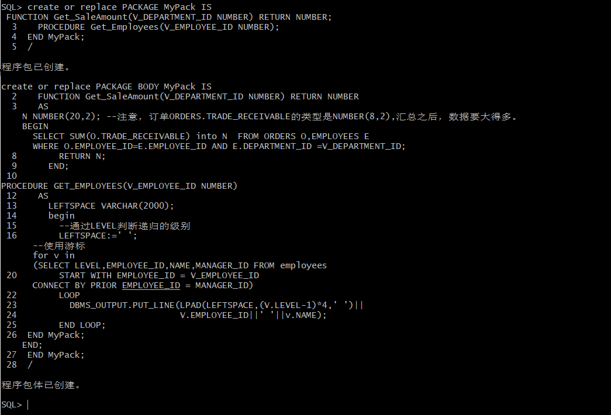
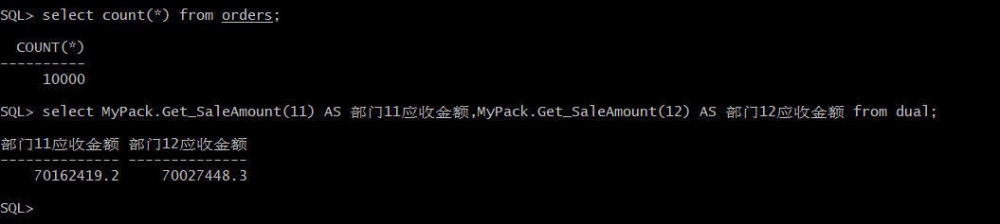
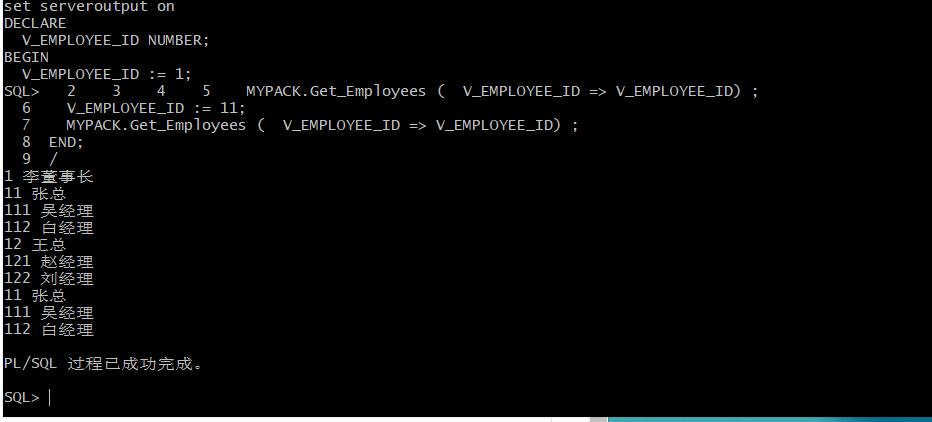

姓名：熊小娇

用户名：new_user_xxj

学号：201810414104

班级：18软工1班


# 实验五 PL/SQL编程

## 实验目的
```
了解PL/SQL语言结构
了解PL/SQL变量和常量的声明和使用方法
学习条件语句的使用方法
学习分支语句的使用方法
学习循环语句的使用方法
学习常用的PL/SQL函数
学习包，过程，函数的用法。
```
## 实验内容
```
1、假设有一个生产某个产品的单位，单位接受网上订单进行产品的销售。通过实验模拟这个单位的部分信息：员工表，部门表，订单表，订单详单表。
2、本实验以实验四为基础

a.创建一个包(Package)，包名是MyPack。
b.在MyPack中创建一个函数SaleAmount ，查询部门表，统计每个部门的销售总金额，每个部门的销售额是由该部门的员工(ORDERS.EMPLOYEE_ID)完成的销售额之和。函数SaleAmount要求输入的参数是部门号，输出部门的销售金额。
c.在MyPack中创建一个过程，在过程中使用游标，递归查询某个员工及其所有下属，子下属员工。过程的输入参数是员工号，输出员工的ID,姓名，销售总金额。信息用dbms_output包中的put或者put_line函数。输出的员工信息用左添加空格的多少表示员工的层次（LEVEL）。比如下面显示5个员工的信息：
d.由于订单只是按日期分区的，上述统计是全表搜索，因此统计速度会比较慢，如何提高统计的速度呢？
```
## 查询语句
### 语句1：
#### 第1步：创建程序包：

#### sql语句
```sql
create or replace PACKAGE MyPack IS
  FUNCTION Get_SaleAmount(V_DEPARTMENT_ID NUMBER) RETURN NUMBER;
  PROCEDURE Get_Employees(V_EMPLOYEE_ID NUMBER);
END MyPack;
/
create or replace PACKAGE BODY MyPack IS
  FUNCTION Get_SaleAmount(V_DEPARTMENT_ID NUMBER) RETURN NUMBER
  AS
    N NUMBER(20,2); 
    BEGIN
      SELECT SUM(O.TRADE_RECEIVABLE) into N  FROM ORDERS O,EMPLOYEES E
      WHERE O.EMPLOYEE_ID=E.EMPLOYEE_ID AND E.DEPARTMENT_ID =V_DEPARTMENT_ID;
      RETURN N;
    END;

  PROCEDURE GET_EMPLOYEES(V_EMPLOYEE_ID NUMBER)
  AS
    LEFTSPACE VARCHAR(2000);
    begin
      --通过LEVEL判断递归的级别
      LEFTSPACE:=' ';
      --使用游标
      for v in
      (SELECT LEVEL,EMPLOYEE_ID,NAME,MANAGER_ID FROM employees
      START WITH EMPLOYEE_ID = V_EMPLOYEE_ID
      CONNECT BY PRIOR EMPLOYEE_ID = MANAGER_ID)
      LOOP
        DBMS_OUTPUT.PUT_LINE(LPAD(LEFTSPACE,(V.LEVEL-1)*4,' ')||
                             V.EMPLOYEE_ID||' '||v.NAME);
      END LOOP;
    END;
END MyPack;
/
```

#### 查询结果：


### 语句2：
#### 第2步：测试数据:
```sql
--函数Get_SaleAmount()测试方法：
select count(*) from orders;
select MyPack.Get_SaleAmount(11) AS 部门11应收金额,MyPack.Get_SaleAmount(12) AS 部门12应收金额 from dual;


--过程Get_Employees()测试代码：
set serveroutput on
DECLARE
  V_EMPLOYEE_ID NUMBER;    
BEGIN
  V_EMPLOYEE_ID := 1;
  MYPACK.Get_Employees (  V_EMPLOYEE_ID => V_EMPLOYEE_ID) ;  
  V_EMPLOYEE_ID := 11;
  MYPACK.Get_Employees (  V_EMPLOYEE_ID => V_EMPLOYEE_ID) ;    
END;
```
#### 查询结果：




### 分析
```
本次实验主要是PL/SQL操作，首先连接上老师的数据库然后连接自己的用户进行实验。
PL/SQL是Oracle数据库对SQL语句的扩展。在普通SQL语句的使用上增加了编程语言的特点，所以PL/SQL就是把数据操作和查询语句组织在PL/SQL代码的过程性单元中，通过逻辑判断、循环等操作实现复杂的功能或者计算的程序语言。
本实验在PL/SQL编程中还涉及到游标的使用。游标提供了在逐行的基础上操作表中数据的方法。游标可以保存查询结果，以便以后使用。游标的结果集是由SELECT语句产生，如果处理过程需要重复使用一个记录集，那么创建一次游标而重复使用若干次，比重复查询数据库要快的多。
因此使用PL/SQL可以让程序整体看起来更直观，程序的逻辑性一目了然。而使用游标方便用户对数据库中的数据一条一条的进行处理。
```
