# 秒杀系统数据设计
## 一、引言
无论是双十一还是12306的购票系统，秒杀场景已经随处可见了。简单来说就是在同一时刻大量的数据情求与同一件商品并完成交易，从架构的角度来看，秒杀系统本质是一个高可用，高一致性高性能的三高系统 ，数据库的设计也是在抗并发的解决措施里面，本数据库设计则是应用于此类秒杀系统中。
## 二、数据库设计
数据库中有8张表，分别是goods（商品表），miaosha_goods（秒杀商品表），miaosha_message（秒杀信息表），miaosha_message_user（秒杀信息用户表），miaosha_order(订单表)，miaosha_user(秒杀用户)，order_info(订单详表).

### 实体属性：
#### 商品实体：
属性的意思分别为goods_name（商品名称），goods_title（商品标题），goods_img（商品图片），goods_details（商品的详细描述），goods_prices（商品价格），goods_stack（商品的库存）。
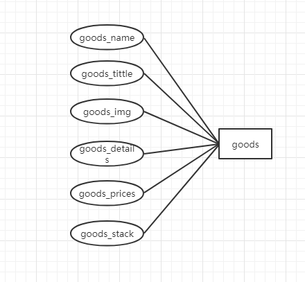
 
#### 秒杀商品实体：
Miaosha_price（秒杀价格），goods_id（商品id），start_date（开始秒杀的时间），end_date（秒杀结束的时间），stock_count（库存数量）。
 
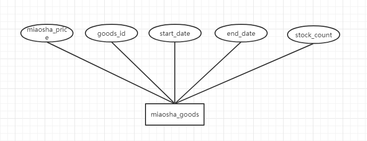
#### 秒杀信息实体；
message_id(信息id), content(信息内容), over_time(结束时间), status(状态), create_time(创建时间), good_name(商品名称), price(价格), send_type(发送类型), message_type(0 秒杀消息 1 购买消息 2 推送消息).
 
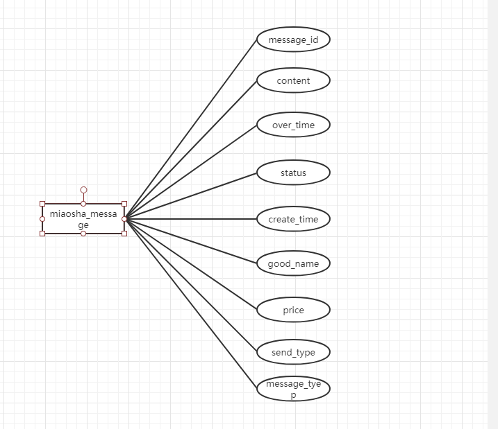

#### 秒杀用户实体；
Nickname(昵称), password(密码), salt， head(头像), register_date(注册日期), last_login_date(最后登录日期), login_count(登录次数).
 
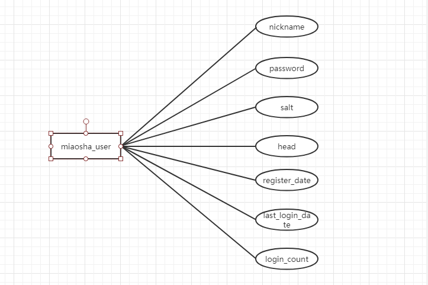

#### 订单详情实体：
User_id(用户id), goods_id(商品id), delivery_addr_id(邮寄方式), goods_name(商品名称), goods_price(商品价格), order_chnner(1pc，2android，3ios), status(订单状态), create_date(创建日期), pay_date(付款日期).

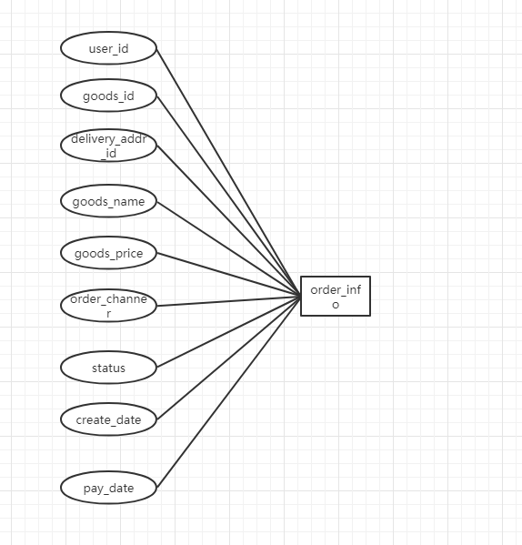
 

#### 关联表：
miaosha_order（秒杀-订单-商品），是将用户，商品、订单三张表关联起来的数据表。
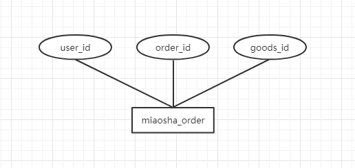
 
Miaosha_message_user（用户-信息-商品-订单），是将用户、商品、信息、订单关联起来的表。

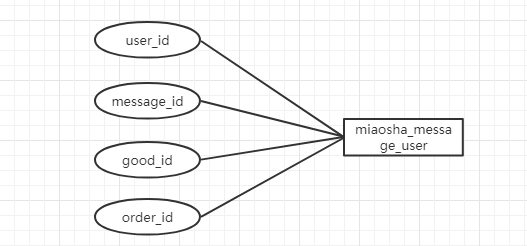
 

##### E-R图
简易的e-r图，如下：
 
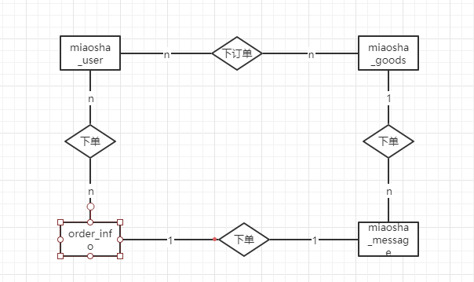


## 三、表和数据添加
### 一、建表和插入数据
如下是本次数据库的建表sql，使用的是pl/sql语言写的一个文件。
在建表之前应该判断数据库中是否有该表的存在，如果有删除，如果没有，则执行建表语句。
这里使用的是查找该表中的数据条数，来判断是是否有表，然后执行drop table 来删除表。Declare表示申明，begin表示执行开始，需要在结尾加上end；/ 表示执行以上所有代码。
```sql
declare
      num   number;
begin
      select count(1) into num from user_tables where TABLE_NAME = 'GOODS';
      if   num=1   then
          execute immediate 'drop table GOODS cascade constraints PURGE';
      end   if;
      
      select count(1) into num from user_tables where TABLE_NAME = 'MIAOSHA_GOODS';
      if   num=1   then
          execute immediate 'drop table MIAOSHA_GOODS cascade constraints PURGE';
      end   if;
      
      select count(1) into num from user_tables where TABLE_NAME = 'MIAOSHA_MESSAGE';
      if   num=1   then
          execute immediate 'drop table MIAOSHA_MESSAGE cascade constraints PURGE';
      end   if;
      
      select count(1) into num from user_tables where TABLE_NAME = 'MIAOSHA_MESSAGE_USER';
      if   num=1   then
          execute immediate 'drop table MIAOSHA_MESSAGE_USER cascade constraints PURGE';
      end   if;
      
      select count(1) into num from user_tables where TABLE_NAME = 'MIAOSHA_ORDER';
      if   num=1   then
          execute immediate 'drop table MIAOSHA_ORDER cascade constraints PURGE';
      end   if;
      
      select count(1) into num from user_tables where TABLE_NAME = 'MIAOSHA_USER';
      if   num=1   then
          execute immediate 'drop table MIAOSHA_USER cascade constraints PURGE';
      end   if;
      
       select count(1) into num from user_tables where TABLE_NAME = 'ORDER_INFOR';
      if   num=1   then
          execute immediate 'drop table ORDER_INFOR cascade constraints PURGE';
      end   if;
      
      select count(1) into num from user_tables where TABLE_NAME = 'USERS';
      if   num=1   then
          execute immediate 'drop table USERS cascade constraints PURGE';
      end   if;
end;
/

```
以下是建表语句，根据数据字段的设计，在数据库中设计数据库表，这里不赘述。
```sql
--创建goods 表
CREATE TABLE GOODS (
  ID NUMBER(6, 0) NOT NULL ,
  GOODS_NAME VARCHAR2(16 BYTE) DEFAULT NULL,
  GOODS_TITLE VARCHAR2(64 BYTE) DEFAULT NULL,
  GOODS_IMG VARCHAR2(64 BYTE) DEFAULT NULL,
  GOODS_DETAILS VARCHAR2(100 BYTE) ,
  GOODS_PRICE NUMBER(10,2)DEFAULT '0.00',
  GOODS_STAOCK NUMBER(11,0)
--  PRIMARY KEY (`id`)
) ;

-- 创建miaosha_goods表
CREATE TABLE MIAOSHA_GOODS(
    ID NUMBER(6,0) NOT NULL,
    GOODS_ID NUMBER(20, 0) DEFAULT NULL,
    MIAOSHA_PRICE NUMBER(10,2) DEFAULT '0.00',
    STOCK_COUNT NUMBER(11) DEFAULT NULL,
    START_DATE DATE  DEFAULT NULL,
    END_DATE DATE  DEFAULT NULL
--    PRIMARY KEY (`id`)
);

--创建miaosha_message表
CREATE TABLE MIAOSHA_MESSAGE(
    ID NUMBER(20, 0) NOT NULL,
    MESSAGE_ID NUMBER(20,0) NOT NULL,
    CONTENT VARCHAR2(100) ,
    CREATE_TIME DATE DEFAULT NULL ,
    STATUS NUMBER(1,0) NOT NULL ,
    OVER_TIME DATE DEFAULT NULL,
    MESSAGE_TYPE NUMBER(1, 0) DEFAULT '3' ,
    SEND_TYPE NUMBER(1) DEFAULT '3' ,
    GOOD_NAME VARCHAR2(50) DEFAULT '' ,
    PRICE NUMBER(10,2) DEFAULT '0.00' 
--    PRIMARY KEY (`id`)
);

--创建miaosha_message_user
CREATE TABLE MIAOSHA_MESSAGE_USER(
    ID NUMBER(20) NOT NULL,
    USER_ID NUMBER(20) NOT NULL,
    MESSAGE_ID NUMBER(38) NOT NULL,
    GOODS_ID NUMBER(20) DEFAULT NULL,
    ORDER_ID NUMBER(20) DEFAULT NULL
);

--创建表miaosha_order表
CREATE TABLE MIAOSHA_ORDER(
    ID NUMBER(20) NOT NULL ,
    USER_ID NUMBER(20) DEFAULT NULL ,
    ORDER_ID NUMBER(20) DEFAULT NULL ,
    GOODS_ID NUMBER(20) DEFAULT NULL 
);

--创建表miaosha_user
CREATE TABLE MIAOSHA_USER(
    ID NUMBER(20) NOT NULL,
    USER_ID NUMBER(20) DEFAULT NULL,
    NICKNAME VARCHAR2(255) NOT NULL,
    PASSWORD VARCHAR2(32) DEFAULT NULL ,
    SALT VARCHAR2(10) DEFAULT NULL,
    HEAD VARCHAR2(128) DEFAULT NULL ,
    REGISTER_DATE DATE DEFAULT NULL ,
    LAST_LOGIN_DATE DATE DEFAULT NULL ,
    LOGIN_COUNT NUMBER(11) DEFAULT '0'
);
-- 创建表order_info
CREATE TABLE ORDER_INFOR (
  ID NUMBER(20) NOT NULL,
  ORDER_ID NUMBER(20) DEFAULT NULL,
  USER_ID NUMBER(20) DEFAULT NULL,
  GOODS_ID NUMBER(20) DEFAULT NULL ,
  DELIVERY_ADDR_ID NUMBER(20) DEFAULT NULL,
  GOODS_NAME VARCHAR2(16) DEFAULT NULL ,
  GOODS_COUNT NUMBER(11) DEFAULT '0',
  GOODS_PRICE NUMBER(10,2) DEFAULT '0.00',
  ORDER_CHANNER NUMBER(4) DEFAULT '0',
  STATUS NUMBER(4) DEFAULT '0',
  CREATE_DATE DATE DEFAULT NULL,
  PAY_DATE DATE DEFAULT NULL
) ;
```
### 二、数据库表导入相应数据
使用pl/sql语句来添加数据。
#### --1、向goods表中添加数据
这里定义了6个数组，数据库表中的每个字段随机从每个数组中选取数据，构成一个记录，插入到数据库中相应表中，数据条数为10000条。
```sql
set SERVEROUTPUT ON;
create or replace function RANDOM
    return number 
    is 
        a number ; 
    begin
        select round(dbms_random.value(1,5)) rnum
        into a 
        from dual;
        return a  ;
    end;
    /

DECLARE
    type goods_name is varray(5) of varchar2(20);
    type goods_details is varray(5) of VARCHAR2(100);
    type goods_img is varray(5) of VARCHAR2(20);
    type goods_info is varray(5) of VARCHAR2(50);
    type goods_price is varray(5) of VARCHAR2(20);
    type goods_have is varray(5) of VARCHAR2(20);

    indexRandom NUMBER;
    goods_name_list goods_name:=goods_name('iphoneX','华为Meta9','小米6','一加','vivo'); 
    goods_details_list goods_details:=goods_details('64GB 银色 移动联通电信4G手机','4GB+32GB版 移动联通电信4G手机 双卡双待','64GB 银色 移动联通电信3G手机','月光银 移动联通电信4G手机','玫瑰金 64g 晓龙a382'); 
    goods_img_list goods_img:=goods_img('/img/iphonex.png','/img/meta10.png','/img/iphone8.png','/img/mi6.png','/img/mi9.png'); 
    goods_info_list goods_info:=goods_info('移动联通电信4G手机','4GB+32GB版','月光银','玫瑰金','64GB 银色'); 
    goods_price_list goods_price:=goods_price('8765.00','3212.00','5589.00','3212.00','7212.00'); 
    goods_have_list goods_have:=goods_have('8765','-1','558','3212','7212'); 
 BEGIN
    dbms_output.put_line(indexRandom);
    DBMS_OUTPUT.PUT_LINE(goods_name_list(5));
    for i in 1..10000
    loop
        indexRandom:=RANDOM();
        INSERT INTO GOODS VALUES (i, goods_name_list(indexRandom), goods_details_list(indexRandom), goods_img_list(indexRandom), goods_info_list(indexRandom), goods_price_list(indexRandom), goods_have_list(indexRandom));
    end loop;
 
 END;
 /

```
#### --2、向miaosha_goods中添加数据
使用for loop语句构造2到2000 的数据，然后根据i值的不同，其后的数据相同，数据条数为2000条，插入到数据库中。
```sql
declare
    result number;
begin
    for i in 2..2000
    loop
        result:=i mod 3;
        if result =0 then
            INSERT INTO MIAOSHA_GOODS VALUES (i, i, '0.01', '9', ('04-12月-17'), ('04-12月-17'));
            DBMS_OUTPUT.PUT_LINE(i);
        elsif result = 1 then
            INSERT INTO MIAOSHA_GOODS VALUES (i, i, '0.25', '12', ('08-11月-18'), ('08-11月-18'));
            DBMS_OUTPUT.PUT_LINE(i);
        else
            INSERT INTO MIAOSHA_GOODS VALUES (i, i, '0.05', '8', ('12-11月-17'), ('12-11月-19'));
            DBMS_OUTPUT.PUT_LINE(i);
        end if;
        exit when i=2000;
    end loop;
end;
/

#### --3、向miaosha_message 中添加数据
如上面的导入数据方式，使用i值的不同，构造不同记录。
declare
begin
    for i in 2..5000
    loop
        INSERT INTO MIAOSHA_MESSAGE VALUES (i,'533324506110885888', '尊敬的用户你好，你已经成功注册！', null, '0', null, null, '0', null, null);
    end loop;
end;
/

#### -- miaosha_user
declare
    id number;
    user_id number;
    nickname number;
begin
    id:=18912341247;
    nickname:=18612766444;
    user_id:=1;
    loop
        id:=id+1;
        user_id:=user_id+1;
        nickname:=nickname+1;
        INSERT INTO MIAOSHA_USER VALUES (id, user_id, nickname, 'b7797cce01b4b131b433b6acf4add449', '1a2b3c4d', null, '11-1月-19', null, '0');
        exit when id=18912344246;
    end loop;
end;
/
#### --4、向order_info中添加数据
导入order_info使用的是循环loop….end，创建变量order_id,user_id，goods_id，并赋以初值，然后在执行完一条insert之后，是这些变量的值进行相应的改变，达到数据导入的目的。
DECLARE
--    INSERT INTO `order_info` VALUES ('1564', '18912341234', '3', null, 'iphone8', '1', '0.01', '1', '0', '2017-12-16 16:35:20', null);
    ORDER_ID NUMBER;
    USER_ID NUMBER;
    GOODS_ID NUMBER;
    ID NUMBER:=1;
BEGIN
--20000
    ORDER_ID:=1564;
    USER_ID:=1;
    GOODS_ID:=1;
    LOOP
        INSERT INTO ORDER_INFOR VALUES(ID, ORDER_ID, USER_ID, GOODS_ID,null, 'iphone8', '1', '0.01', '1', '0', '16-12月-17', null);
        ORDER_ID:=ORDER_ID+1;
        USER_ID:=USER_ID+1;
        GOODS_ID:=GOODS_ID+1;
        EXIT ???
    END LOOP;
END;
/

```
## 四、ORACLE中相关配置
首先就是新建pdb 的操作，oracle没有办法对cdb进行操作，只能操作pdb，所以在oracle中的开始，我就需要新建一个pdb数据库，以上的相关操作，都是建立在这次之后的操作，这里新建一个salespdb的pdb数据库。
大致解释以下语句的含义：
Create pluggable database 就是新建一个pdb的语句，其中salespdb是数据库的名称，然后就是用户名和密码，使用的tablespace的大小，默认的存储文件地址。
```sql
CREATE PLUGGABLE DATABASE salespdb ADMIN USER sale5deng IDENTIFIED BY sale5deng STORAGE (MAXSIZE 2G) DEFAULT TABLESPACE sales DATAFILE '/database/oracle/oracle/oradata/orcl/salespdb/sales01.dbf' SIZE 250M AUTOEXTEND ON PATH_PREFIX = '/database/oracle/oracle/oradata/orcl/salespdb/' FILE_NAME_CONVERT = ('/database/oracle/oracle/oradata/orcl/pdbseed/', '/database/oracle/oracle/oradata/orcl/salespdb/');
```
#### 一、表设计
创建表空间的过程，创建了三个表空间，分别叫做sales，sales02，sales03，大小最大为50M，数据文件存放在/database/oracle/oracle/oradata/orcl/orclpdb/目录下面。
```sql
CREATE TABLESPACE SALES 
DATAFILE '/database/oracle/oracle/oradata/orcl/salespdb/sales.dbf' 
SIZE 100M AUTOEXTEND ON NEXT 50M MAXSIZE UNLIMITED 
EXTENT MANAGEMENT LOCAL SEGMENT SPACE MANAGEMENT AUTO;

CREATE TABLESPACE USERS01 
DATAFILE '/database/oracle/oracle/oradata/orcl/ salespdb / sales02.dbf' 
SIZE 100M AUTOEXTEND ON NEXT 50M MAXSIZE UNLIMITED 
EXTENT MANAGEMENT LOCAL SEGMENT SPACE MANAGEMENT AUTO;

CREATE TABLESPACE USERS02 
DATAFILE '/database/oracle/oracle/oradata/orcl/ salespdb / sales03.dbf' 
SIZE 100M AUTOEXTEND ON NEXT 50M MAXSIZE UNLIMITED 
EXTENT MANAGEMENT LOCAL SEGMENT SPACE MANAGEMENT AUTO;

```
#### 二、用户管理
##### 创建用户
这里创建了两个用户，分别叫做sale5deng和buyer5deng
```sql
SYSTEM@192.168.44.183:1521/salespdb>create role sales5deng identified sales5deng;
角色已创建。

SYSTEM@192.168.44.183:1521/salespdb>create role buyer5deng identified buyer5deng;
角色已创建。
##### 权限配置
给刚创建的两个用户添加connect，resource，create view的权限

SYSTEM@192.168.44.183:1521/salespdb>grant connect, resource, CREATE VIEW TO sales5deng;
授权成功。

SYSTEM@192.168.44.183:1521/salespdb>grant connect, resource, CREATE VIEW TO buyer5deng;
授权成功。
```
##### 表空间分配
数据库中有三个刚才创建的表空间，分别为sales，sales02，sales03.
```sql
SYSTEM@192.168.44.229:1521/salespdb>select tablespace_name from user_tablespaces;

TABLESPACE_NAME
------------------------------
SYSTEM
SYSAUX
UNDOTBS1
TEMP
SALES
SALES02
SALES03

已选择 7 行。
```

#### 三、PL/SQL设计
查找miaosha_order 表中的数据，使用miaosha_user的user_id，使用存储过程queryUser传入user_id，从miasha_order表中查出相应的数据记录，然后取出goods，使用goods_id，在miaosha_goods中进行查询，查询出相应的记录
```sql
set serveroutput on;

create or replace procedure queryUser
(
    u_user_id in MIAOSHA_USER.user_id%type,
    u_goods_id out miaosha_goods.goods_id%type
)
as
begin

    select goods_id into u_goods_id from order_infor where order_id = (select order_id  from (select  order_id from miaosha_order where rownum=1 and miaosha_order.user_id=u_user_id));
    dbms_output.put_line(u_goods_id);
--    select * from order_infor where order_infor.order_id=u_order_id;
    

exception
    when no_data_found then
        dbms_output.put_line('error');
        when others then
        dbms_output.put_line('one error');
end queryUser;
/

--调用
declare
    v1 miaosha_goods.goods_id%TYPE;

BEGIN
    queryUser('178', v1);
    dbms_output.put_line('name');
end;
输出结果如下。
Procedure QUERYUSER 已编译

423
name

PL/SQL 过程已成功完成。
```
#### 四、备份设计
##### 备份
从虚拟机中拷贝出脚本文件rman_leve10.sh(全备份)，rman_level1.sh(增量备份)，查看脚本内容
```sql
[oracle@oracle-pc ~]$ cat rman_level0.sh 
#rman_level0.sh 
#!/bin/sh

export NLS_LANG='SIMPLIFIED CHINESE_CHINA.AL32UTF8'
export ORACLE_HOME=/home/oracle/app/oracle/product/12.1.0/dbhome_1  
export ORACLE_SID=orcl  
export PATH=$ORACLE_HOME/bin:$PATH  


rman target / nocatalog msglog=/home/oracle/rman_backup/lv0_`date +%Y%m%d-%H%M%S`_L0.log << EOF
run{
configure retention policy to redundancy 1;
configure controlfile autobackup on;
configure controlfile autobackup format for device type disk to '/home/oracle/rman_backup/%F';
configure default device type to disk;
crosscheck backup;
crosscheck archivelog all;
allocate channel c1 device type disk;
backup as compressed backupset incremental level 0 database format '/home/oracle/rman_backup/dblv0_%d_%T_%U.bak'
   plus archivelog format '/home/oracle/rman_backup/arclv0_%d_%T_%U.bak';
report obsolete;
delete noprompt obsolete;
delete noprompt expired backup;
delete noprompt expired archivelog all;
release channel c1;
}
EOF

exit
```
在用户oracle下运行脚本rman_level10.sh，


 
*.log 是日志文件
Dblv0*.bak 是数据库的备份文件
arclv0*.bak是归档日期的备份文件
c-1392946895-20191120-01是控制文件和参数的备份。
###### 修改数据
```sql
[oracle@oracle-pc ~]$ sqlplus study/123@pdborcl
SQL> create table t2 (id number,name varchar2(50));
Table created.
SQL> insert into t2 values(1,'zhang');
1 row created.
SQL> commit;
Commit complete.
SQL> select * from t2;

        ID NAME
---------- --------------------------------------------------
         1 zhang
SQL> exit

```
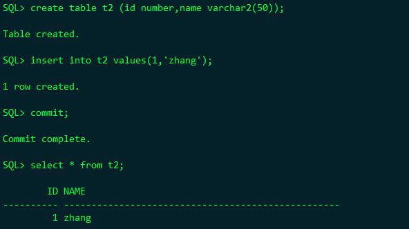

##### 删除数据
```sql
[oracle@oraclepc~]$ rm/home/oracle/app/oracle/oradata/orcl/pdborcl/SAMPLE_SCHEMA_users01.dbf

挂载数据库到mount状态
SQL> shutdown immediate
ORA-01116: 打开数据库文件 10 时出错
ORA-01110: 数据文件 10: '/home/oracle/app/oracle/oradata/orcl/pdborcl/SAMPLE_SCHEMA_users01.dbf'
ORA-27041: 无法打开文件
Linux-x86_64 Error: 2: No such file or directory
Additional information: 3
SQL> shutdown abort
ORACLE instance shut down.
SQL> startup mount
ORACLE instance started.

Total System Global Area 1577058304 bytes
Fixed Size                  2924832 bytes
Variable Size             738201312 bytes
Database Buffers          654311424 bytes
Redo Buffers               13848576 bytes
In-Memory Area            167772160 bytes
Database mounted.
SQL>
 
 ```
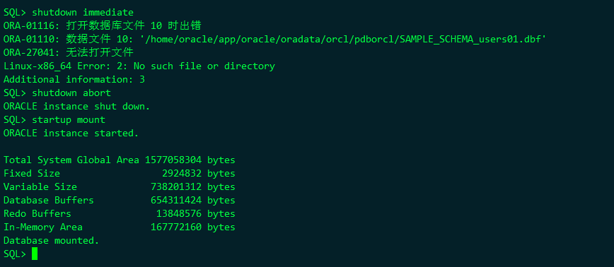
#### 恢复数据
```sql
[oracle@oracle-pc ~]$ rman target /
RMAN> restore database ;

 ```
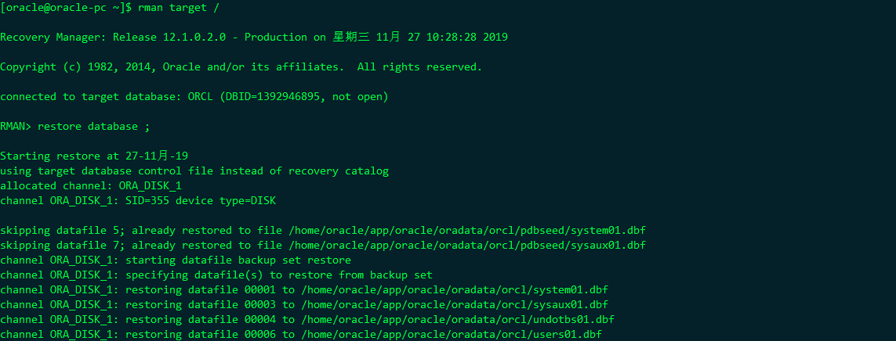
## 五、所遇到的问题和如何解决的
####①、lsnrctl status 无监听
使用lsnrctl start来开启监听，但是在开启的过程中，监听要去寻找一个叫做listen.ora的文件，当时我将此文件更名为listen.ora.bak，所以在启动的时候没有找到文件，一直没有启动起来。
Lsnrctl的基本操作有server，start，stop。

#### ②、ORACEL12C ORA-01033: ORACLE 正在初始化或关闭 进程 ID: 0 会话 ID: 0 序列号: 0
Oracle 中和其他版本的数据的启动关闭都是一样的，但是12c中有一个特殊点，就是在启动的时候需要修改会话到链接的pdb上面。例如：alter session set container=orclpdb.
参考下面地址：https://www.jianshu.com/p/5571e0413ff4

#### ③、容灾实验过程 中，无法使用rman登录到指定的数据。
这里是我在填写监听的时候，还是写的是orcl，不是stdorcl，所以使用rman target sys1/123@stdorcl则是无法登录的。
 

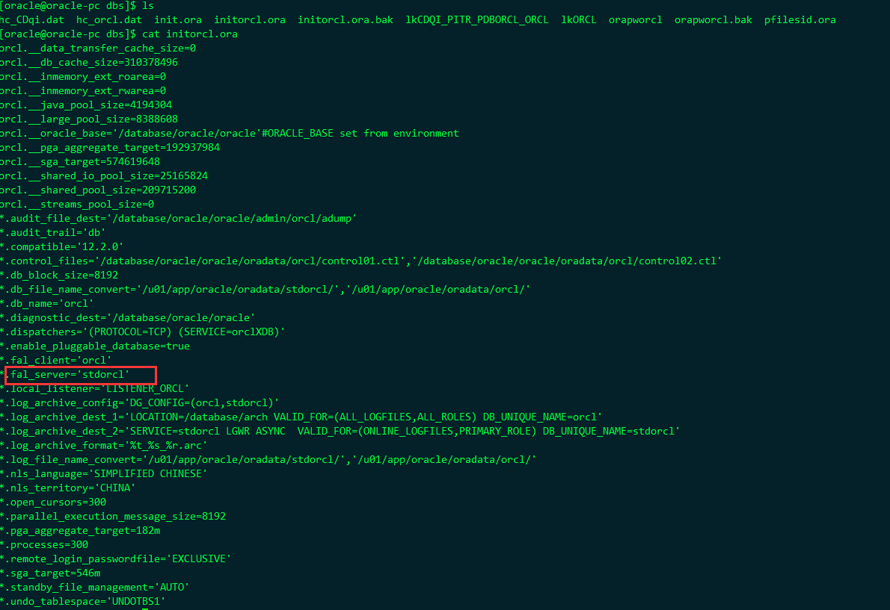
#### ④、SQL Oracle 查询出来的数据取第一条
```sql
select * from (select * from <table> order by <key>) where rownum=1;

select * from (select * from <table> order by <key> desc) where rownum=1;
```

#### ⑤、使用sys或system用户登录，却没有权限？
Sqlplus “/ as sysdba” 这样登录进去、
